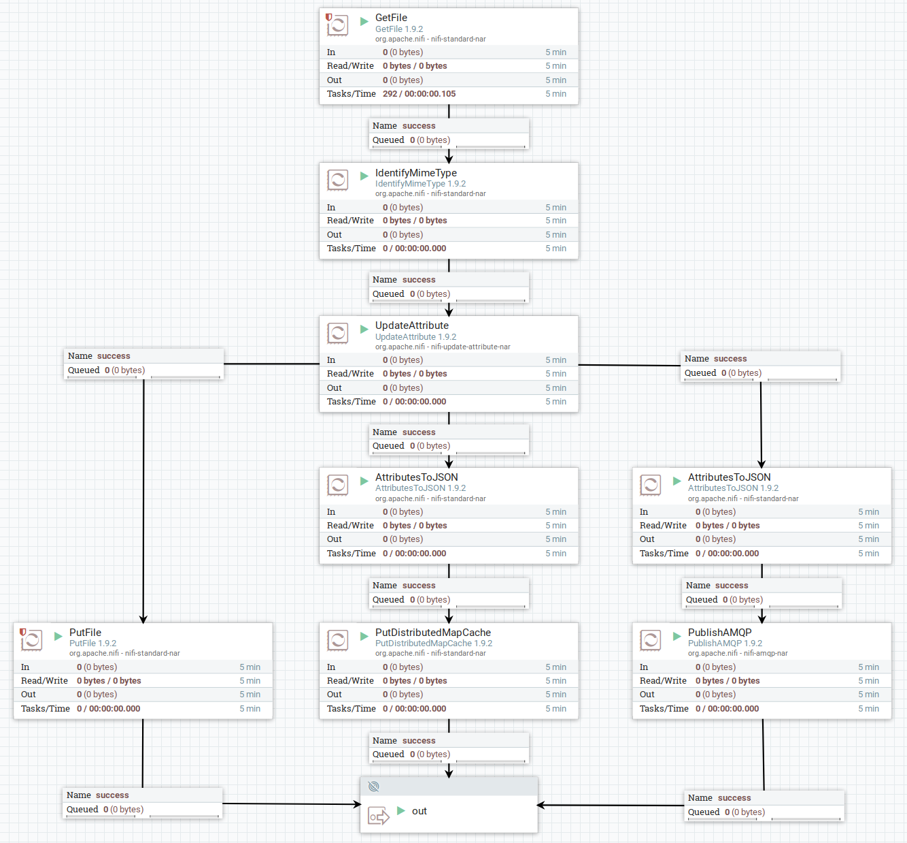

# sqAPI System

## About
*sqAPI System* is a complete system for receiving files and being able to
make query towards data- and metadata stores, to make aggregated data of these files.

The system will receive files, store them in an object database,
the metadata of the files are stored in a key-value store,
and a notification is published on the message broker.

When a message is received, each *sqAPI* subscribed to that specific queue,
will query relevant files from the key-value store and the object database.
Each *sqAPI* has its own responsibility area, and will query data and metadata
independent of each other. The data aggregated within the *sqAPI*, will be stored in
the *sqAPI*s local data storage, which kind depends up on what data it's intended for.

When a user wants to search, aggregate or in other ways access the data,
they will through the web ui access all necessary *sqAPI*s exposed APIs.


# Components
This project consist of a set of components,
all intended to populate a central storage unit,
then execute specific logic on incoming data and expose the new data set to the users.

The components are represented by specific technologies in this project,
but it is possible to change these with other similar alternatives.

| Component | Technology | Description |
| --------- | ---------- | ----------- |
| `Data Loader` | `NiFi` | Loading data into `Data Store`, `Metadata Store` and `Message Broker` |
| `Data Store` | `Xubuntu file system` | Keeping original incoming files |
| `Metadata Store` | `Redis` | Holding metadata with ID reference to `Data Store` location |
| `Message Broker` | `RabbitMQ` | Publishes messages to each active `sqAPI`-instance |
| `sqAPI` | `Python` | System for execute queries on subscribed data, based on specific subset, to make it available |
| `sqAPI Storage` | `PostgreSQL` | Local storage for each `sqAPI`, keeps record of all messages and aggregated data |


## Data Loader
As Data Loader, NiFi is used to move files on the disk, into Redis, and the message queue.

* Store file to `Data Store` (_on disk_)
* Store metadata in `Metadata Store` (_Redis_)
* Notify `Message Broker` (_RabbitMQ_) of received file
  * Message should contain `Metadata Store`- and `Data Store`-references

### Preparation
#### IO directories
After NiFi has started,
the following folders should be created to
`docker exec -u 0 -it nifi bash -c "mkdir -p /io/{input,output}/ && chown nifi:nifi -R /io"`

#### Flow
When uploading a file into NiFi, the *Main*-flow is executed.

After *Main*, the flow is forked into three:
*Store File*, *Store Metadata*, *Publish Message*




##### Main
* `GetFile`: Picks up files for processing
  * `Input Directory`: `/io/input`
  * Load custom files with `docker cp <file> nifi:/io/input/`
* `IdentifyMimeType`: Sets `mime.type` as attribute
* `UpdateAttribute`: Creates attributes for sqAPI message fields
  * `data_type`: `${mime.type}`
  * `data_location`: `/io/output/${uuid}`
  * `meta_location`: `redis/${uuid}`
  * `uuid_ref`: `${uuid}`
  * `filename`: `${uuid}`

##### Store file
* `PutFile`: Stores files on disk
  * `Directory`: `/io/output`

##### Store metadata
* `AttributesToJSON`: Extracts metadata from file, and creates new FlowFile with attributes as JSON content
  * `Destination`: `flowfile-content`
* `PutDistributedMapCache`: Inserts attributes (metadata) as JSON, into Redis
  * `Distributed Cache Service`: `RedisDistributedMapCacheClientService`
    * `Redis Connection Pool`: `RedisConnectionPoolService`
      * `Connection String`: `redis:6379`

##### Publish Message
* `AttributesToJSON`: Extracts metadata from file, and creates new FlowFile with attributes as JSON content
  * `Destination`: `flowfile-content`
  * `Attributes List`: `data_type, data_location, meta_location, uuid_ref`
* `PublishAMQP`: Publish messages to RabbitMQ
  * `Exchange Name`: `x_sqapi`
  * `Routing Key`: `q_sqapi`
  * `Host Name`: `mq`


## Data Store
Local disk is used as storage for the loaded files.
Next step would probably be to use AWS S3 as object storage.


## Graphical User Interface
`Curl` will be used until a Web-frontend solution is in place.
Planned GUI will be developed in ReactJS.


## sqAPI
_Subscription, Query, API_ is a plugin-based component intended to:
* Subscribe to the `Message Broker`
* Query data from `Data Store`
* Query metadata from `Metadata Store`
* Aggregate and store custom data set in `sqAPI Storage`
* Serve aggregated data and metadata through an API

New data from the queue will trigger a query and aggregation of the newly incoming data.
All aggregated data will be stored in a *sqAPI* specific storage solution (`sqAPI Storage`),
dependent on the intentions of the current *sqAPI*.

When a user wants to access the aggregated data, they will connect to the API directly or through the GUI,
and the *sqAPI* will perform necessary searches in its local database,
and possibly queries towards `Data Store` and `Metadata Store` for fetching necessary supplements to return to the user.


## sqAPI Storage
The sqAPI storage is a chosen storage solution, based on the configuration.
Each sqAPI plugin will have its own database connection, dependent on its custom data set structure.

### Preparation
Independent of storage type, there should be a setup function made available,
to create necessary structures to fill the following needs:
* Failed messages
  * Messages failed processing should be stored locally
  * Messages failed in query step, should be retried after a defined amount of time
* Modified data
  * Aggregated data should be stored locally for searches and sqAPI logic


# Getting Started

## Docker Compose
The Docker Compose solution will create a container for each active component in the [sqAPI PoC](./sqapi).
Each of the components are linked together in the same Docker Network.

The Docker Compose solution is built and started with the following
```bash
docker-compose build
docker-compose up -d
```

## sqAPI
This PoC is based on a file system as origin to the files, a Redis instance as origin for the metadata,
a RabbitMQ for message bus, and PostgreSQL to store the processed data.

### Test sqAPI PoC
Use the following to start the sqAPI PoC, with both subscription/query and API, and insert test data.
```bash
# Start Redis, RabbitMQ and PostgreSQL
docker run -d -p 6379:6379 redis:latest
docker run -d -p 5672:5672 rabbitmq:latest
docker run -d -p 5432:5432 postgres

# Start sqAPI
./sqapi/start.py

# Produce test data
./data_producer.py
```


### sq & API
`sqAPI` can be started as two separate services,
where one is responsible for loading the data,
while the other is responsible to serve the API.

This will let the Loader being able to load data even though the API is down,
as well as users are able to access data when the loader is down.

#### sqAPI Loader
```bash
python3 sqapi/start.py loader
```

#### sqAPI API
```bash
python3 sqapi/start.py api
```

# Contribution
There are multiple ways to contribute to *sqAPI*:
* Adding plugins
* Increased support
* Core logic

## Plugins
sqAPI is based of having all of its business logic implemented in plugins.

To contribute with a new plugin, please see
[the plugin section](./sqapi/plugins/README.md)
for information regarding structure, requirements and implementation details.

## Support
*sqAPI* supports a given set of external systems.
If you have a system not supported, feel free to report an issue or create a pull request.

#### External connections 
* Database
* Data Store
* Metadata Store
* Message Broker

Each of these sections should support as many external systems as possible.
The more, the merrier!

## Core
The core functionality should always be improved,
so if you find a bug, an issue or some improvement potential -
feel free to commit a fix or a feature. 
