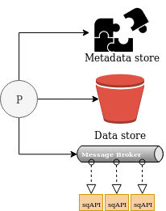
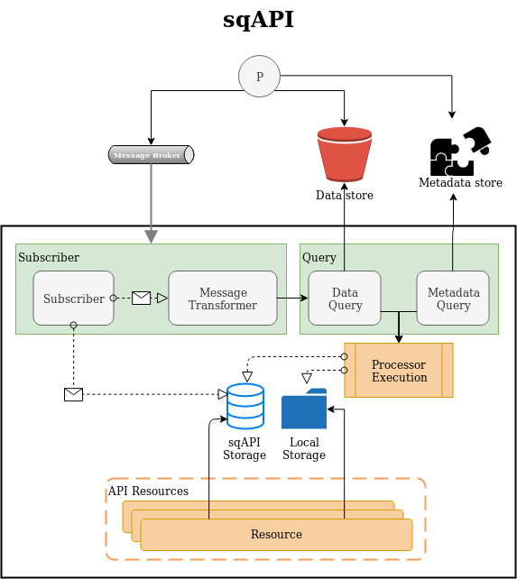

# sqAPI

## About
*sqAPI* is a plugin based system for subscribing to messages,
query towards data- and metadata stores,
aggregate and expose data to the users.

Receiving a message will make the system fetch referred data and metadata,
and execute all active plugins for custom data aggregation.
The aggregated data will be stored in a local database, and on disk if necessary.

Each *sqAPI* plugin has its own area of responsibility, and will query data and metadata
independent of each other. The data aggregated within the plugin, will be stored in
the *sqAPI*s local data storage.
The storage type depends up on what data it's intended for.

When a user wants to search or in other ways access the data,
they will through all necessary *sqAPI*s exposed APIs.

## Graphic illustrations
### Overview
This figure gives an overview of *sqAPI*s position within a storage system.
As indicated within the figure,
there is intended to deploy multiple *sqAPI* instances within the complete system.
Each deployed sqAPI will have its own area of responsibility (_active plugin_).



### Details
The graphic below presents the flow and different components within the sqAPI solution.
The orange areas (_Processor Execution_ and _Resources_) are custom logic for each of the plugins.




# Getting Started
## sqAPI
### Prerequisites
sqAPI is dependent on receiving messages, and being able to fetch elements from external systems.
Use the following to start the external systems, the internal database and sqAPI.

Use [data producer](resources/test/data_producer.py) to insert test data.
```bash
# Start Redis, RabbitMQ and PostgreSQL
docker run -d -p 6379:6379 redis:latest
docker run -d -p 5672:5672 rabbitmq:latest
docker run -d -p 5432:5432 postgres

# Start sqAPI
./sqapi/start.py

# Produce test data
./resources/data_producer.py
```

## Docker Compose
The Docker Compose solution will start several containers,
based on the [example system](resources/docs/EXAMPLE_SYSTEM.md).
Each of the components are linked together in the same Docker Network.

The Docker Compose solution is built and started with the following
```bash
docker-compose build
docker-compose up -d
```

## sq & API
`sqAPI` can be started as two separate services,
where one is responsible for loading the data,
while the other is responsible to serve the API.

This will let the Loader being able to load data even though the API is down,
as well as users are able to access data when the loader is down.

### sqAPI Loader
```bash
python3 sqapi/start.py loader
```

### sqAPI API
```bash
python3 sqapi/start.py api
```


# Contribution
There are multiple ways to contribute to *sqAPI*:
* Core logic
* Adding plugins
* Increased support

## Core
The core functionality should always be improved,
so if you find a bug, an issue or some improvement potential -
feel free to commit a fix or a feature.


## Plugins
sqAPI is based on having all of its business logic implemented as plugins.

To contribute with a new plugin, please see [the plugin section](resources/docs/PLUGINS.md)
for information regarding structure, requirements and implementation details.


## Support
*sqAPI* supports a given set of external systems.
If you have a system not supported, feel free to report an issue or create a pull request.

Each of these external connections should support as many external systems as possible.
The more, the merrier!

#### External connections
* Database
* Data Store
* Metadata Store
* Message Broker
