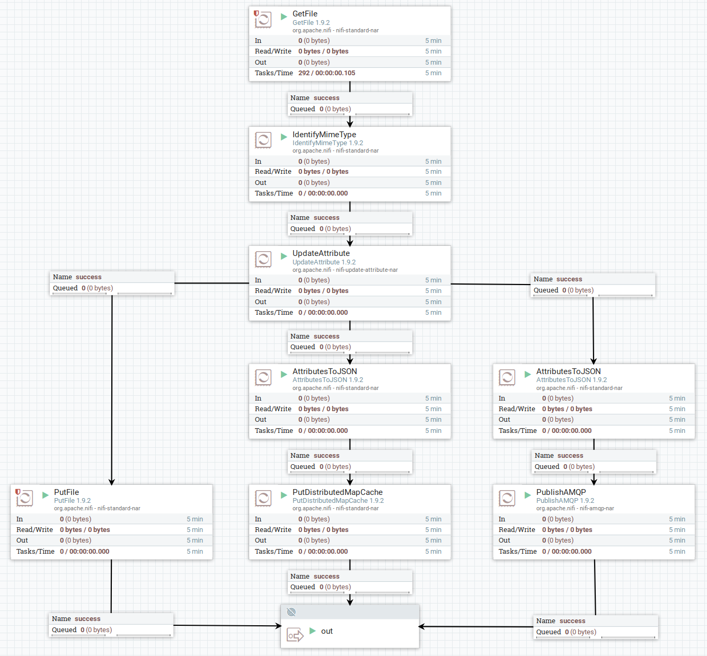

# sqAPI System

## About
*sqAPI System* is a complete system for receive files and being able to
make query towards aggregated data of these files.

The system will receive files, store them in a object database (or disk in this _PoC_),
the metadata of the files are stored in a key-value store,
and a notification is published on the message broker.

When a message is received, each *sqAPI* subscribed to that specific queue,
will query relevant files from the key-value store and the object database.
Each *sqAPI* has its own responsibility area, and will query data and metadata
independent of each other. The data aggregated within the *sqAPI*, will be stored in
the *sqAPI*s local data storage, which kind depends up on what data it's intended for.

When a user wants to search, aggregate or in other ways access the data,
they will through the web ui access all necessary *sqAPI*s exposed APIs.


# Components

## NiFi
NiFi is used to move files into the message queue.

* Store file on disk
* Store metadata in Redis
* Notify RabbitMQ of received file
  * Message should contain Redis ref. and path to stored file

### Preparation
#### IO directories
After NiFi has started,
the following folders should be created to
`docker exec -u 0 -it nifi bash -c "mkdir -p /io/{input,output}/ && chown nifi:nifi -R /io"`

#### Flow
When uploading a file into NiFi, the *Main*-flow is executed.

After *Main*, the flow is forked into three:
*Store File*, *Store Metadata*, *Publish Message*



##### Main
* `GetFile`: Picks up files for processing
  * `Input Directory`: `/io/input`
  * Load custom files with `docker cp <file> nifi:/io/input/`
* `IdentifyMimeType`: Sets `mime.type` as attribute
* `UpdateAttribute`: Creates attributes for sqAPI message fields
  * `data_location`: `/io/output/${uuid}`
  * `data_type`: `${mime.type}`
  * `filename`: `${uuid}`
  * `meta_location`: `redis/${uuid}`
  * `uuid_ref`: `${uuid}`

##### Store file
* `PutFile`: Stores files on disk
  * `Directory`: `/io/output`

##### Store metadata
* `AttributesToJSON`: Extracts metadata from file, and creates new FlowFile with attributes as JSON content
  * `Destination`: `flowfile-content`
* `PutDistributedMapCache`: Inserts attributes (metadata) as JSON, into Redis
  * `Distributed Cache Service`: `RedisDistributedMapCacheClientService`
    * `Redis Connection Pool`: `RedisConnectionPoolService`
      * `Connection String`: `redis:6379`

##### Publish Message
* `AttributesToJSON`: Extracts metadata from file, and creates new FlowFile with attributes as JSON content
  * `Destination`: `flowfile-content`
  * `Attributes List`: `data_type, data_location, meta_location, uuid_ref`
* `PublishAMQP`: Publish messages to RabbitMQ
  * `Exchange Name`: `x_sqapi`
  * `Routing Key`: `q_sqapi`
  * `Host Name`: `mq`


## Redis
Redis is used for key-value store/map cache,
to keep metadata about files uploaded.

### Tools
Within the [Redis directory](./redis) it exists two scripts,
one for writing to Redis, and one to read out based on input arguments.

#### Prerequisites
* Using _redis_ python client for communication with the Redis instance
  * `pip3 install redis --upgrade`


## RabbitMQ
RabbitMQ is used as message broker.
* Receive messages from NiFi
* Publish these messages on the queue

### Tools
Within the [RabbitMQ directory](./rabbitmq) there is created four files:
* [queue_producer](rabbitmq/queue_producer.py): publish single messages
* [queue_consumer](rabbitmq/queue_consumer.py): fetch messages from single queue
* [exchange_producer](rabbitmq/exchange_producer.py): publish messages to all queues
* [exchange_consumer](rabbitmq/exchange_consumer.py): fetch messages from custom queue

These files are only used as a PoC for this system.

#### Prerequisites
* Using _Pika_ python client for AMQP protocol
  * `pip3 install pika --upgrade`


## sqAPI
_Subscription, Query, API_ is a component intended to subscribe to the message broker,
query data from disk/storage place and metadata from key-value store/map cache.

New data from the queue will trigger a query and aggregation of the newly incoming data.
All aggregated data will be stored in a *sqAPI* specific storage solution,
dependent on the current *sqAPI* intentions.

When a used wants to access the *sqAPI*s data, they will connect to the API and the *sqAPI*
will perform necessary searches and queries towards its local database,
or towards the storage for fetching data and metadata to return to the user.

### Incoming data
* Register subscription to RabbitMQ
* Query for file metadata when RabbitMQ notifies
* Query for files on disk when RabbitMQ notifies
* Store data in local storage (PostgreSQL)

### Incoming user request
* Perform necessary searches in local database
* Fetch data/metadata based on local results
* Return data/metadata to used based on request

## Storage
PostgreSQL is used to keep the data for the current PoC

## User Interface
`Curl` will be used until a Web-frontend solution is in place


# Testing
## sqAPI
This PoC is based on a file system as origin to the files,
a Redis instance as origin for the metadata,
a RabbitMQ for message bus,
and PostgreSQL to store the processed data.

### Up and running

```bash
# Start Redis, RabbitMQ and PostgreSQL
docker run -d -p 6379:6379 redis:latest
docker run -d -p 5672:5672 rabbitmq:latest
docker run -d -p 5432:5432 postgres

# Start sqAPI
./start.py

# Produce test data
./data_producer.py
```

### Docker Compose
The Docker Compose solution will create a container
for each active component in the PoC.

#### Components
##### sqAPI
The sqAPI component is started as two individual services, to keep the logic separated:
* Loader
* API

This will let the Loader being able to load data even though the API is down,
as well as users are able to access data when the loader is down.

###### sqAPI Loader
```bash
python3 start.py loader
```

###### sqAPI API
```bash
python3 start.py api
```

##### NiFi
NiFi should be configured with the following processors

###### GetFile
Picks up files from the pickup place.
This is the point of entry for the sqAPI-PoC flow.

###### PutDistributedMapCache
Used to push data to Redis and is configured with: 
* `RedisDistributedMapCacheClientService`
* `RedisConnectionPoolService`

###### PutFile
Used to push the file to disk, making it available for sqAPI.

##### Redis
```bash

```

##### RabbitMQ
```bash

```

##### PostgreSQL
```bash

```

##### Web
```bash

```


#### Running
```bash
docker-compose up -d
```

