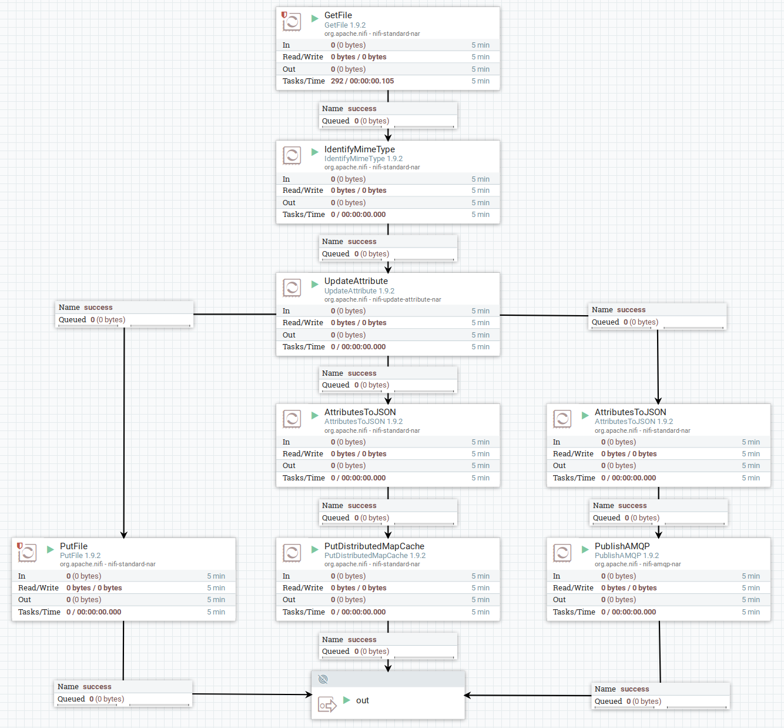

# Example System
This is a document describing how an example system can be created,
where you have the whole flow from the Data Loader,
through the data aggregation and exposing the data to the end user.

## Components
This example consist of a set of components, all intended to populate a central storage unit,
execute specific logic on receive message and expose the aggregated data to the users.

The components are represented by specific technologies in this example,
but it is possible to switch to other similar alternatives.

| Component | Technology | Description |
| --------- | ---------- | ----------- |
| `Data Loader` | `NiFi` | Loading data into `Data Store`, `Metadata Store` and `Message Broker` |
| `Data Store` | `Xubuntu file system` | Keeping original incoming files |
| `Metadata Store` | `Redis` | Holding metadata with ID reference to `Data Store` location |
| `Message Broker` | `RabbitMQ` | Publishes messages to each active `sqAPI`-instance |
| `sqAPI` | `Python` | System for executing queries based on a subscription, fetch, aggregate and expose data |
| `sqAPI Storage` | `PostgreSQL` | Local storage for each `sqAPI`, keeps record of all messages and aggregated data |

## Data Loader
As Data Loader, NiFi is used to move files onto the disk, into Redis, and notify the message broker.

* Pick up incoming files
* Store file to `Data Store` (_on disk_)
* Store metadata in `Metadata Store` (_Redis_)
* Notify `Message Broker` (_RabbitMQ_) of received file
  * Message should contain `Metadata Store`- and `Data Store`-references, as well as data type

### Preparation
#### IO directories
After NiFi has started, the following folders should be created and given permissions:
`docker exec -u 0 -it nifi bash -c "mkdir -p /io/{input,output}/ && chown nifi:nifi -R /io"`

#### Flow
When uploading a file into NiFi, the *Main*-flow is executed.

After *Main*, the flow is forked into three:
*Store File*, *Store Metadata*, *Publish Message*

##### Main
* `GetFile`: Picks up files for processing
  * `Input Directory`: `/io/input`
  * Load custom files with `docker cp <file> nifi:/io/input/`
* `IdentifyMimeType`: Sets `mime.type` as attribute
* `UpdateAttribute`: Creates attributes for sqAPI message fields
  * `data_type`: `${mime.type}`
  * `data_location`: `/io/output/${uuid}`
  * `meta_location`: `redis/${uuid}`
  * `uuid_ref`: `${uuid}`
  * `filename`: `${uuid}`

##### Store file
* `PutFile`: Stores files on disk
  * `Directory`: `/io/output`

##### Store metadata
* `AttributesToJSON`: Extracts metadata from file, and creates new FlowFile with attributes as JSON content
  * `Destination`: `flowfile-content`
* `PutDistributedMapCache`: Inserts attributes (metadata) as JSON, into Redis
  * `Distributed Cache Service`: `RedisDistributedMapCacheClientService`
    * `Redis Connection Pool`: `RedisConnectionPoolService`
      * `Connection String`: `redis:6379`

##### Publish Message
* `AttributesToJSON`: Extracts metadata from file, and creates new FlowFile with attributes as JSON content
  * `Destination`: `flowfile-content`
  * `Attributes List`: `data_type, data_location, meta_location, uuid_ref`
* `PublishAMQP`: Publish messages to RabbitMQ
  * `Exchange Name`: `x_sqapi`
  * `Routing Key`: `q_sqapi`
  * `Host Name`: `mq`

## Data Store
Local disk is used as storage for the loaded files.
Next step would probably be to use AWS S3 as object storage.

## sqAPI
_Subscription, Query, API_ is a plugin-based component intended to:
* Subscribe to the `Message Broker`
* Query data from `Data Store`
* Query metadata from `Metadata Store`
* Aggregate and store custom data set in `sqAPI Storage`
* Serve aggregated data and metadata through the API

New data from the queue will trigger a query and aggregation of the newly incoming data.
All aggregated data will be stored in a *sqAPI* specific storage solution (`sqAPI Storage`).
Which database used is dependent on the intentions of the current *sqAPI* and the custom data set.

When a user wants to access the aggregated data, they will connect to the API,
and the *sqAPI* will perform necessary searches in its local database.
If needed, the sqAPI also have access to execute queries towards the `Data Store`
and `Metadata Store` for fetching necessary supplements to return to the user.

## sqAPI Storage
The sqAPI storage is a chosen storage solution, based on the configuration.
Each sqAPI plugin will have its own database connection, dependent on its custom data set structure.

### Preparation
Independent of storage type, there should be a setup function made available,
to create necessary structures to fill the following needs:
* Failed messages
  * Messages failed processing should be stored locally
  * Messages failed in query step, should be retried after a defined amount of time
* Modified data
  * Aggregated data should be stored locally for searches and sqAPI logic
